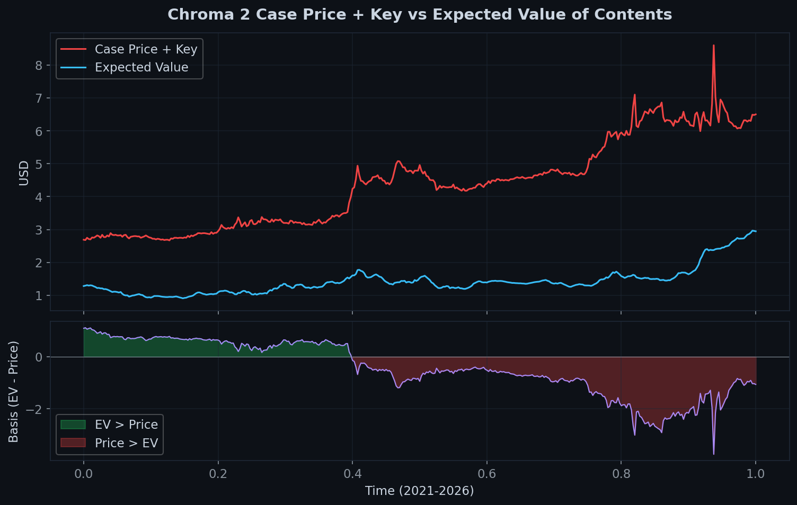
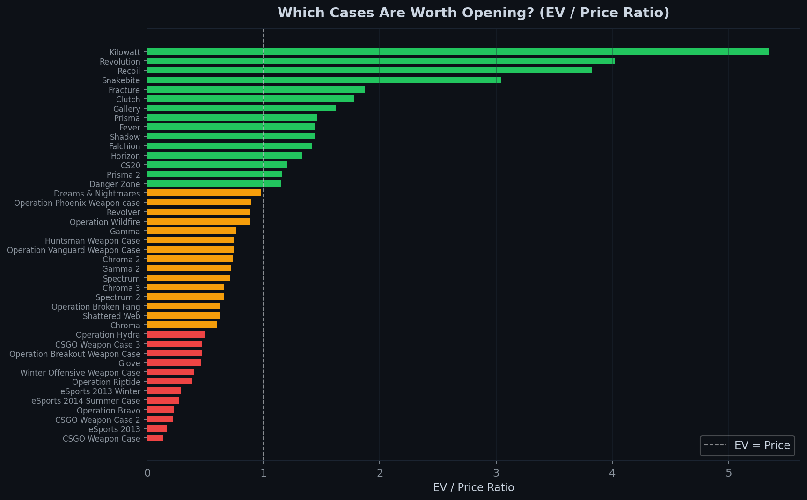

# Case EV vs Case Price Dynamics

Investigation into how CS2 case prices and the expected value (EV) of their contents evolve over time. Tests whether case prices lead or lag the EV of their contents — an analogue to spot-forward basis or NAV deviations in traditional markets.



## Quick Start

```bash
python -m http.server 8000
# Open http://localhost:8000
```

The dashboard works immediately — all analysis is precomputed into `data/precomputed/`.

## The Signal

Each CS2 case contains skins at known rarity tiers with known unboxing probabilities. At any time _t_, the expected value of opening a case is:

```
EV(t) = Sum over items [ P(rarity) / N_tier * P(wear) * P(stattrak) * median_price(item, wear, t) ]
```

The **basis** is `EV(t) - CasePrice(t) - KeyCost`. When positive, opening is +EV. When negative, the case trades at a premium.



## Key Findings

| Finding | Detail |
|---------|--------|
| All 42 cases trend (H > 0.6) | No mean-reversion in the EV-price basis — this is a momentum market |
| Price leads EV in 27/42 cases | Speculative demand drives case prices first, contents adjust later |
| EV/Price is the strongest signal | Cases with high EV relative to price systematically outperform |
| Fees kill short-horizon strategies | 5% round-trip on Buff163 destroys any edge at < 14-day rebalance |
| 7-day hold period is binding | Steam's trade lock eliminates short-term mean-reversion trades |

### EV predicts 7-day forward case returns
1-day EV return predicts 7-day forward case price return with average correlation +0.11, positive in **38 of 42 cases**. Strongest: Operation Broken Fang (+0.29), Glove (+0.27), Fracture (+0.25).

### Best cases to open (EV/Price > 1)
| Case | EV/Price | Worth Opening? |
|------|----------|---------------|
| Kilowatt | 5.35x | Yes |
| Revolution | 4.02x | Yes |
| Recoil | 3.82x | Yes |
| Snakebite | 3.05x | Yes |
| eSports 2013 | 0.17x | No |
| CSGO Weapon Case | 0.13x | No |

## Analysis Modules

The dashboard runs 10 quantitative analysis modules per case, per timescale:

- **Core Statistics** — correlation, return distributions, spread z-score
- **Efficiency** — lead-lag / Granger-like cross-correlation
- **Volatility** — rolling vol, AR(1), mean-reversion half-life
- **Cross-Section** — EV/Price ratio time series
- **Hurst Exponent** — trending vs mean-reverting regime classification
- **Autocorrelation** — return predictability structure
- **Cointegration** — ADF test, error-correction speed
- **Regime Detection** — structural break identification
- **Trading Signals** — z-score bands with buy/sell thresholds
- **Liquidity** — absolute return proxy for bid-ask spread

## Regenerating from Raw Data

```bash
# Download raw price data (requires Google Drive access)
pip install gdown
python setup_data.py

# Regenerate all 42 case analysis JSONs
python src/precompute.py
```

## Data

- **Source**: [PriceEmpire API](https://pricempire.com/) aggregating 70+ marketplaces
- **Period**: 2021-03-24 to 2026-03-24 (5 years daily)
- **Cases**: 42 (all major CS2 cases)
- **Items**: 2,565 skins, knives, and gloves across all cases
- **Providers**: 13-14 exchanges per item (Buff163, Steam, CSFloat, DMarket, etc.)

## Part of [CS2 Quant Research](https://github.com/cgarryZA/Quant)

Christian Garry — CS2 Quant Research Series
